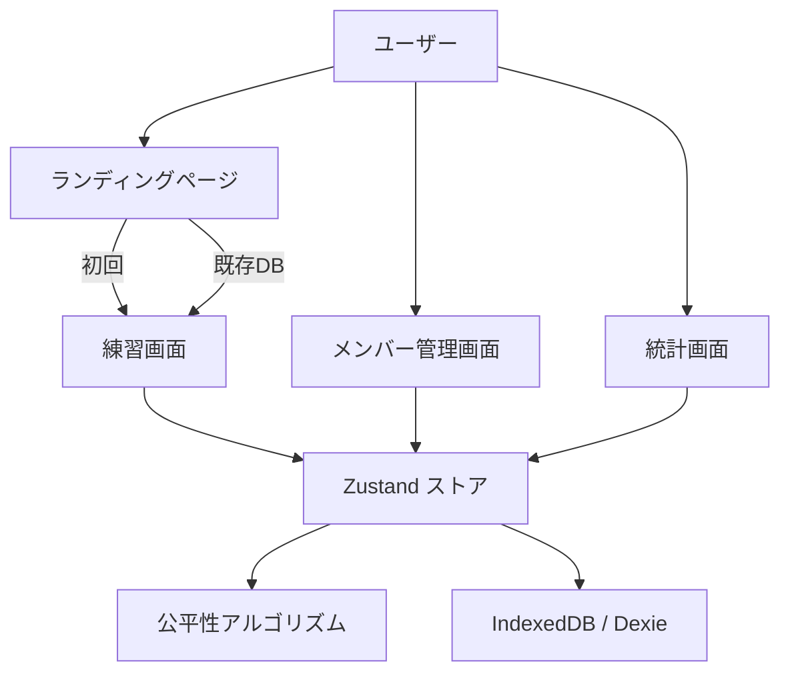
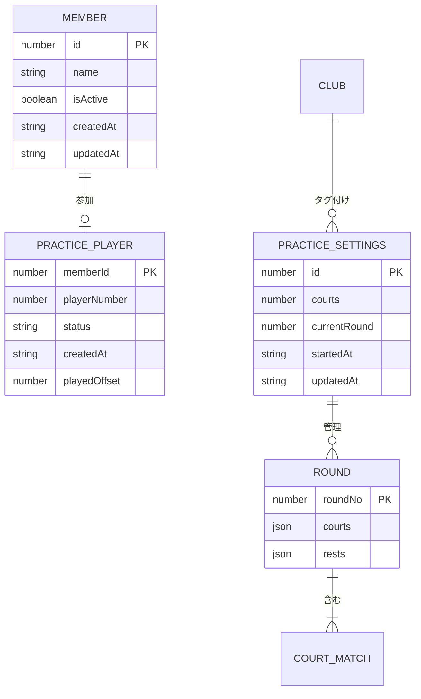
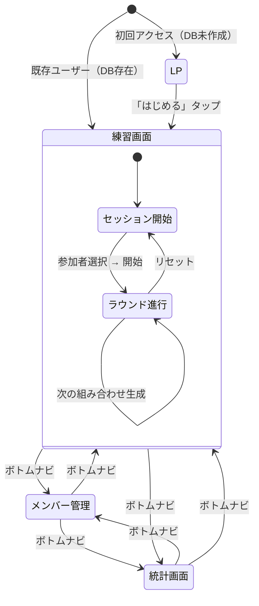
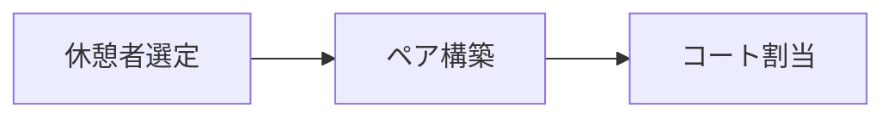
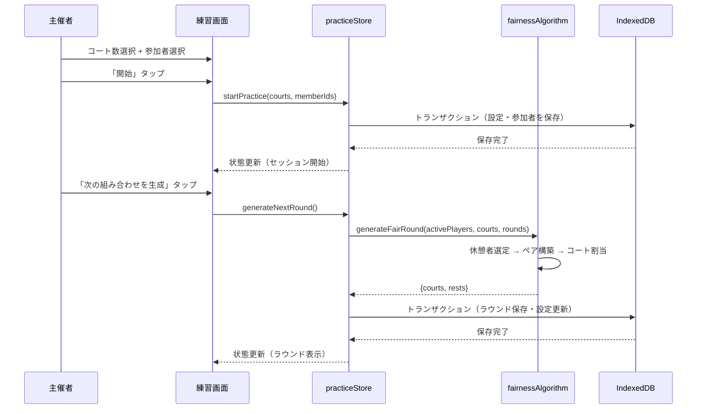
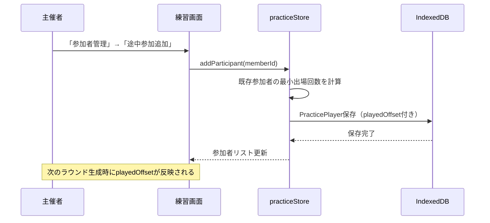
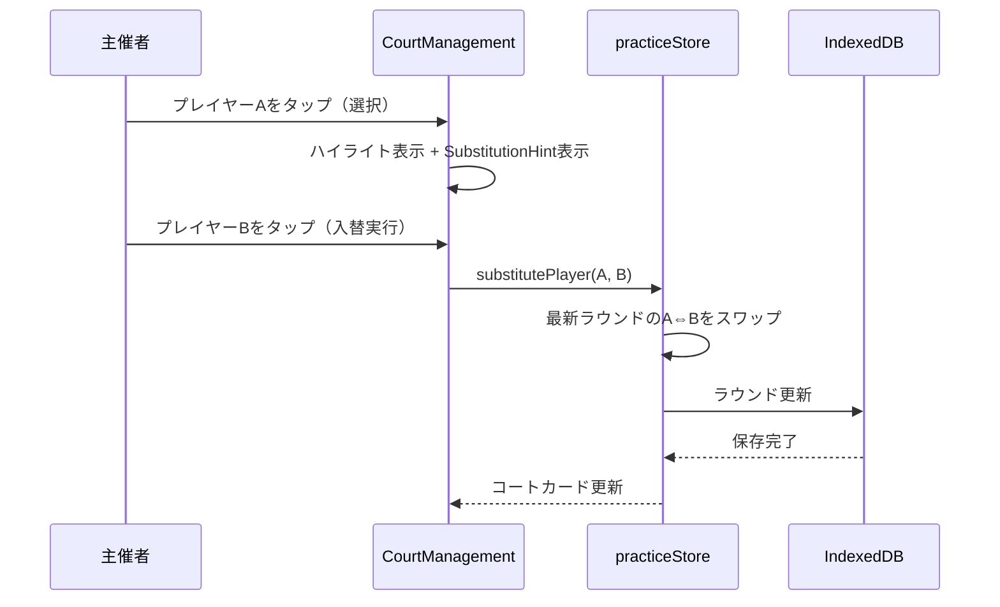
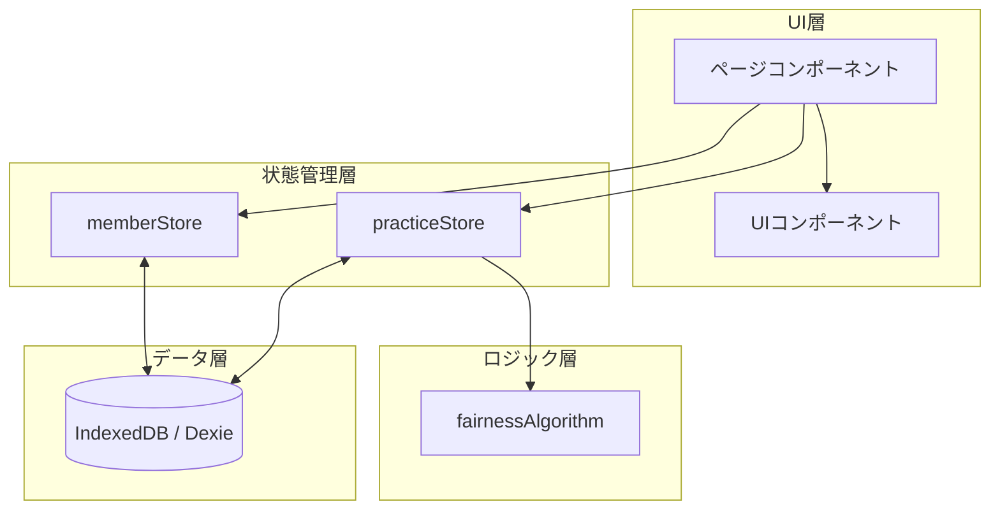

# 機能設計書 (Functional Design Document)

## システム構成図



## 技術スタック

| 分類 | 技術 | 選定理由 |
|------|------|----------|
| 言語 | TypeScript 5.x | 型安全性による品質担保 |
| フレームワーク | Next.js (App Router) | SSG/PWA対応、ファイルベースルーティング |
| UIライブラリ | React 18+ | コンポーネントベースの宣言的UI |
| 状態管理 | Zustand | 軽量でボイラープレートが少ない |
| データベース | Dexie.js (IndexedDB) | オフライン完結のクライアントサイドDB |
| スタイリング | Tailwind CSS | ユーティリティファーストで高速開発 |
| アイコン | Lucide React / react-icons | 一貫性のあるアイコンセット |
| パッケージマネージャー | npm | Node.js v24標準 |

## データモデル定義

### エンティティ: Member（メンバー）

```typescript
interface Member {
  id: number;           // 自動採番 (++id)
  name: string;         // メンバー名
  isActive: boolean;    // アクティブ/非アクティブ
  createdAt: string;    // 作成日時 (ISO 8601)
  updatedAt: string;    // 更新日時 (ISO 8601)
}
```

**制約**:
- `name` は空文字不可（トリム後）
- `id` は自動採番で一意

### エンティティ: PracticeSettings（練習設定）

```typescript
interface PracticeSettings {
  id: number;              // 固定値: 1（シングルトン）
  courts: number;          // コート数 (2〜6)
  currentRound: number;    // 現在のラウンド番号 (0 = 未開始)
  startedAt: string | null; // 練習開始日時
  updatedAt: string;       // 更新日時
  clubId?: number;         // 練習場所（クラブ）のID
}
```

**制約**:
- `id` は常に 1（1レコードのみ）
- `courts` は 2〜6 の整数
- `currentRound` は 0 以上の整数

### エンティティ: PracticePlayer（練習参加者）

```typescript
type PlayerStatus = 'active' | 'rest';

interface PracticePlayer {
  memberId: number;       // Primary Key（Member.id への参照）
  playerNumber: number;   // 選択順に振られる番号（1始まり）
  status: PlayerStatus;   // 出場可 / 休憩
  createdAt: string;      // 参加日時
  playedOffset?: number;  // 途中参加時の試合数補正値
}
```

**制約**:
- `memberId` は一意（1メンバーにつき1レコード）
- `playerNumber` は参加順に連番
- `playedOffset` は途中参加者のみ設定（既存参加者の最小試合数を初期値とする）

### エンティティ: Round（ラウンド）

```typescript
interface CourtMatch {
  courtNo: number;              // コート番号 (1始まり)
  pairA: [number, number];      // チームAのmemberIds
  pairB: [number, number];      // チームBのmemberIds
}

interface Round {
  roundNo: number;        // Primary Key（ラウンド番号）
  courts: CourtMatch[];   // 各コートの対戦情報
  rests: number[];        // 休憩者のmemberIds
}
```

**制約**:
- `roundNo` は 1 以上の連番
- 各コートに必ず4名（pairA 2名 + pairB 2名）
- 1プレイヤーは1ラウンドで1コートまたは休憩のいずれか

### エンティティ: Club（クラブ）

```typescript
interface Club {
  id?: number;       // 自動採番 (++id)
  name: string;      // クラブ名
  createdAt: string;  // ISO 8601
  updatedAt: string;  // ISO 8601
}
```

**制約**:
- `name` は空文字不可（トリム後）
- `id` は自動採番で一意

### エンティティ: PairStats（ペア統計）

```typescript
interface PairRecord {
  player1: number;  // 小さい方のmemberId
  player2: number;  // 大きい方のmemberId
  count: number;    // ペア回数
}

interface PairStats {
  sessionId?: string;
  pairs: PairRecord[];
  lastUpdated: string;
}
```

### 統計用型定義

```typescript
interface PlayerStats {
  playerId: number;
  playedCount: number;       // 出場回数（playedOffset込み）
  restCount: number;         // 休憩回数
  consecRest: number;        // 最大連続休憩数
  recentPartners: number[];  // 直近パートナー履歴（最大5件）
  recentOpponents: number[]; // 直近対戦相手履歴（最大5件）
}

interface FairnessScore {
  playedVariance: number;        // 出場回数の分散
  restVariance: number;          // 休憩回数の分散
  consecutiveRestPenalty: number; // 連続休憩ペナルティ
  duplicatePairCount: number;    // 重複ペア数
  duplicateMatchCount: number;   // 重複対戦数
  totalScore: number;            // 総合スコア
}
```

### ER図



## 画面遷移図



## ページ構造

| パス | ページ | 対応機能 |
|------|--------|----------|
| `/` | ランディングページ | 初回ユーザー向けLP / 既存ユーザーは`/practice`へリダイレクト |
| `/practice` | 練習画面 | F2, F3, F4, F5 |
| `/members` | メンバー管理画面 | F1 |
| `/stats` | 統計画面 | F8 |

## コンポーネント設計

### レイアウト共通

| コンポーネント | 責務 |
|--------------|------|
| `Header` | アプリヘッダー（タイトル、ヘルプボタン） |
| `BottomNavigation` | 画面切替用ボトムナビゲーション（練習・メンバー・統計） |
| `HelpModal` | 使い方ヘルプのモーダル表示 |

### 練習画面コンポーネント

| コンポーネント | 責務 |
|--------------|------|
| `ParticipantSelection` | セッション開始前の参加者選択・コート数設定UI |
| `CourtSelector` | コート数選択UI（タイル形式） |
| `CourtManagement` | ラウンド進行中のコートカード・休憩者表示 |
| `ParticipantManagement` | 参加者ステータス管理モーダル（active/rest切替） |
| `AddParticipantModal` | 途中参加者追加モーダル |
| `SubstitutionHint` | 入替操作中のヒント表示 |
| `FullscreenDisplay` | フルスクリーン掲示表示 |
| `PlayerNumber` | プレイヤー番号バッジ |

### メンバー管理コンポーネント

| コンポーネント | 責務 |
|--------------|------|
| `MembersPage` | メンバー一覧・検索・追加・編集・削除の統合ページ |

### 統計コンポーネント

| コンポーネント | 責務 |
|--------------|------|
| `PairStatsPanel` | ペア頻度統計の表示（マトリクス形式） |
| `OpponentStatsPanel` | 対戦相手頻度統計の表示（マトリクス形式） |
| `RoundHistory` | ラウンド履歴の表示 |

## 状態管理設計

### memberStore（メンバーストア）

**責務**: メンバーのCRUD操作とIndexedDBとの同期

```typescript
type State = {
  members: Member[];
  isLoading: boolean;
  isInitialLoad: boolean;
  error: string | null;
};

type Actions = {
  load: () => Promise<void>;                              // DB全件読込
  add: (name: string) => Promise<void>;                   // メンバー追加
  update: (id: number, updates: Partial<Pick<Member, 'name' | 'isActive'>>) => Promise<void>; // 更新
  remove: (id: number) => Promise<void>;                  // 削除
  clearError: () => void;                                 // エラークリア
};
```

### practiceStore（練習ストア）

**責務**: 練習セッションの全状態管理・ラウンド生成・IndexedDBとの同期

```typescript
type State = {
  settings: PracticeSettings | null;
  players: PracticePlayer[];
  rounds: Round[];
  isLoading: boolean;
  isInitialLoad: boolean;
  error: string | null;
};

type Actions = {
  load: () => Promise<void>;                                        // DB全件読込
  startPractice: (courts: number, memberIds: number[]) => Promise<void>; // セッション開始
  toggleStatus: (memberId: number) => Promise<void>;                // active/rest切替
  generateNextRound: () => Promise<void>;                           // ラウンド生成
  resetPractice: () => Promise<void>;                               // セッションリセット
  addParticipant: (memberId: number) => Promise<void>;              // 途中参加
  substitutePlayer: (from: number, to: number) => Promise<void>;    // 選手入替
  updateCourts: (courts: number) => Promise<void>;                  // コート数変更
  clearError: () => void;                                           // エラークリア
};
```

## 機能別詳細仕様

### F1: メンバー管理

#### 画面: `/members`

**メンバー一覧**:
- 名前の日本語ソート順で表示
- 検索バーによるリアルタイムフィルタリング
- 練習参加中のメンバーにはインジケータ表示
- グリッドレイアウト（モバイル1列、タブレット2列）

**メンバー追加**:
- 固定フッターの「選手を追加」ボタンからモーダルを開く
- 名前のみの入力で即座に登録
- `isActive: true` で作成
- トースト通知で完了を表示

**メンバー編集**:
- 各メンバーカードの編集アイコンからモーダルを開く
- 名前の変更が可能
- 保存後にフラッシュアニメーションで変更箇所を強調

**メンバー削除**:
- 確認ダイアログで誤操作防止
- 練習参加中のメンバーは削除不可（トーストで通知）

### F2: 練習セッション開始

#### 画面: `/practice`（セッション未開始状態）

**コート数設定**:
- `CourtSelector` コンポーネントでタイル選択（2〜6面）
- デフォルト値: 2面

**参加者選択**:
- `ParticipantSelection` コンポーネント
- アクティブメンバーの一覧を表示
- タップでトグル選択
- 最低4名を選択しないと開始ボタンが無効化

**セッション開始処理**:
1. IndexedDB内の既存セッションデータをクリア（practiceSettings, practicePlayers, rounds）
2. `PracticeSettings` を作成（`currentRound: 0`）
3. 選択されたメンバーIDから `PracticePlayer` を生成（選択順に `playerNumber` を付与）
4. トランザクション内で一括保存

### F3: 公平な組み合わせ自動生成

#### エントリーポイント

`practiceStore.generateNextRound()` から `fairnessAlgorithm.generateFairRound()` を呼び出す。

#### アルゴリズム概要

公平性アルゴリズムは3段階の最適化で構成される:



#### ステップ1: 休憩者選定（selectRestPlayers）

**目的**: 出場/休憩回数の偏りを最小化する休憩者の組み合わせを選ぶ

**計算ロジック**:
1. `restSlots = 参加者数 - (コート数 × 4)` で休憩者数を算出
2. 休憩候補者を試合回数が多い順・休憩回数が少ない順に収集
3. 全候補の組み合わせについてスコアを計算し、最小スコアの組み合わせを選択

**スコア計算式**:
```
スコア = (出場回数分散 × 320) + (出場回数レンジ × 140)
       + (休憩回数分散 × 28) + (休憩回数レンジ × 18)
       + (最少出場者が休憩 → +90)
       + (連続休憩ペナルティ × 180 × (連続数-1))
       + (直近休憩者重複 → +36)
       + (前々回休憩者重複 → +16)
       + (前回と完全一致 → +880)
       + (前々回と完全一致 → +220)
       + (3回前と完全一致 → +110)
```

**特例処理**:
- 参加者数 / 必要人数 > 1.5 の場合、連続休憩ペナルティを無効化（大人数時の柔軟性確保）

#### ステップ2: ペア構築（buildPairs）

**目的**: 直近のペア履歴を考慮し、重複を最小化するペアを構築

**計算ロジック**:
1. 試合数が少ない順にソート
2. 6回の試行（1回目はソート順、2回目以降はシャッフル）で最適ペアを探索
3. 各プレイヤーについて、最大3名の低コスト候補からランダム選択

**ペアペナルティ**:
- 直近1回前のパートナー: 30点
- 2回前: 24点（-6減衰）
- 3回前: 18点
- 4回前: 12点
- 5回前: 6点（最低6点）

#### ステップ3: コート割当（buildCourtsFromPairs）

**目的**: 対戦相手の重複を最小化するコート配置を決定

**計算ロジック**:
1. ペアの全組み合わせをバックトラック探索
2. 各組み合わせの対戦ペナルティ + 対戦頻度ペナルティの合計を計算
3. 最小スコアの配置を採用

**対戦ペナルティ**:
- 直近1回前の対戦相手: 12点
- 2回前: 9点（-3減衰）
- 3回前: 6点
- 4回前: 3点
- 5回前: 2点（最低2点）

**対戦頻度ペナルティ**:
- 過去全ラウンドの対戦回数 × 4（重み）

#### 特例: 4人1コート

4人で1コートの場合、3パターンを固定順序で繰り返す:
- パターン1: [1-2 vs 3-4]
- パターン2: [1-3 vs 2-4]
- パターン3: [1-4 vs 2-3]

#### 途中参加者の公平性補正（playedOffset）

途中参加者には、既存参加者の最小出場回数を `playedOffset` として設定する。アルゴリズム内部では `playedOffset - 1` を初期値として使用し、次ラウンドでの出場を優先する。

### F4: ラウンド進行操作

#### 画面: `/practice`（セッション進行中）

**ヘッダー情報**:
- ラウンド数・コート数・参加者数をバッジ表示
- 各バッジタップで詳細モーダルを開く

**コートカードUI**:
- `CourtManagement` コンポーネント
- 各コートをカードで表示（COURT 1, 2, ...）
- チームA / チームBを左右に配置
- 各プレイヤーはタップ可能なボタン

**休憩者表示**:
- コートカード下部にピル形式で休憩者を表示
- 休憩者もタップ可能（入替操作用）

**選手入替（Substitution）**:
1. コートまたは休憩者のプレイヤーをタップ（1人目選択 → ハイライト表示）
2. 別のプレイヤーをタップ（2人目選択 → 即座にスワップ実行）
3. 同じプレイヤーを再タップで選択解除
4. `SubstitutionHint` で操作中のガイドを表示

**コート数変更**:
- モーダルでコート数を変更可能（練習中でも）
- `CourtSelector` で選択後「更新」で反映

**参加者ステータス管理**:
- `ParticipantManagement` モーダル
- 各プレイヤーの active / rest 切替
- 途中参加者追加ボタン
- 出場回数の表示

**ラウンド生成**:
- 固定フッターの「次の組み合わせを生成」ボタン
- 2回目以降は確認ダイアログを表示
- active状態のプレイヤーが4名未満の場合はボタン無効化
- 生成後、コートカード領域へ自動スクロール

**練習リセット**:
- 確認ダイアログ付き
- 全ラウンドデータ・参加者データ・設定を削除

### F5: フルスクリーン掲示

#### コンポーネント: `FullscreenDisplay`

**表示内容**:
- ヘッダー: 「第Nラウンド」
- 各コートをカード形式で大きく表示
- チームA / チームBの選手名とプレイヤー番号
- 休憩者一覧
- 閉じるボタン（Escapeキー対応）

**操作**:
- 掲示中でも選手タップによる入替操作が可能
- 「次の組み合わせを生成」ボタンを下部に固定表示

**アクセシビリティ**:
- プレイヤー番号と名前の併用表示（色覚多様性対応）
- 大きなタップ領域（min-h: 36px以上）

### F6: データ永続化・復元

#### IndexedDB スキーマ

データベース名: `pairkuji`

```
テーブル: members
  インデックス: ++id, name, isActive, createdAt, updatedAt

テーブル: practiceSettings
  インデックス: id, updatedAt

テーブル: practicePlayers
  インデックス: memberId (PK), playerNumber, status, createdAt

テーブル: rounds
  インデックス: roundNo (PK)

テーブル: pairStats
  インデックス: ++id, sessionId, lastUpdated
```

**自動保存**:
- すべての状態変更は即座にIndexedDBに書き込み
- Zustandストアの各Actionがトランザクション内でDB操作を実行
- `updatedAt` タイムスタンプを全更新時に付与

**状態復元**:
- アプリ起動時に各ストアの `load()` でDBからデータを読込
- `PracticeSettings` が存在すれば練習進行中として復元
- ラウンド履歴を `roundNo` 昇順で読込

**初回データ**:
- DB初回作成時に4名のサンプルメンバーを自動投入（Aくん、Bさん、Cくん、Dさん）

### F7: PWA対応

**Service Worker**:
- Next.jsのPWA対応によるオフライン動作
- 静的アセットのCache First戦略

**マニフェスト設定**:
- アプリ名: 「ペアくじ」
- ホーム画面へのインストール対応
- アイコン: 192px / 512px

**オフライン動作**:
- 全データがIndexedDBに保存されるため、ネットワーク不要で完全動作
- 初回インストール後は通信なしで起動可能

### F8: 統計表示

#### 画面: `/stats`

**前提条件**:
- 練習セッションが開始されていない場合は空状態メッセージを表示

**フィルタ**:
- **クラブフィルタ**: クラブ登録がある場合、ピルボタンで「すべて」「クラブA」「クラブB」...を切替可能
- **期間フィルタ**: 今回 / 過去3回 / 今月 / 全期間

**タブ構成**:

| タブ | コンポーネント | 表示内容 |
|------|--------------|----------|
| ペア統計 | `PairStatsPanel` | ペア（同チーム）の組み合わせ頻度 |
| 対戦相手統計 | `OpponentStatsPanel` | 対戦相手の対戦頻度 |

**ペア統計の計算**:
- 全ラウンドを走査し、各コートの pairA / pairB 内の2名をペアとしてカウント
- キー形式: `${小さいID}-${大きいID}`

**対戦相手統計の計算**:
- 全ラウンドを走査し、pairA の各メンバーと pairB の各メンバーの組み合わせをカウント
- キー形式: `${小さいID}-${大きいID}`

## ユースケース図

### UC1: 練習の開始からラウンド生成まで



### UC2: 途中参加



### UC3: 選手入替



## UI設計

### カラーコーディング

| 用途 | 色 | 説明 |
|------|-----|------|
| チームA/B | primary/30 | コートカード内のチーム背景 |
| 休憩者 | muted | 休憩者エリアの背景 |
| 入替選択中 | warning | 選択中プレイヤーのハイライト |
| エラー | destructive | エラーメッセージ・削除ボタン |
| 練習参加中 | accent | メンバー一覧での参加中インジケータ |

### タップ領域

- コートカード内プレイヤーボタン: min-h 48px
- フルスクリーン内プレイヤーボタン: min-h 36px
- 休憩者ピル: min-h 44px
- 全ボタン: active:scale[0.97] のフィードバック

## データフロー



**データの流れ**:
1. ページコンポーネントがストアのアクションを呼び出す
2. ストアがIndexedDBにデータを永続化
3. ストアが内部状態を更新し、UIに反映
4. ラウンド生成時のみ公平性アルゴリズムを呼び出し

## エラーハンドリング

### エラーの分類

| エラー種別 | 処理 | ユーザーへの表示 |
|-----------|------|-----------------|
| DB読み込み失敗 | ストアの `error` フィールドに設定 | エラーバナー表示（閉じるボタン付き） |
| 参加者不足 (< 4名) | 生成処理を中断 | 「参加者が4名未満のため組み合わせを生成できません」 |
| 重複参加 | 追加処理を中断 | 「この選手は既に参加しています」 |
| 練習中の削除 | 削除処理を中断 | 「練習に参加中の選手は削除できません」（トースト） |
| DB書き込み失敗 | ストアの `error` フィールドに設定 | エラーバナー表示 |

### トースト通知

- 成功操作（追加・編集・削除）はトースト通知で表示
- 2.5秒で自動消去
- 画面下部中央にアニメーション付きで表示

## パフォーマンス最適化

- **ラウンド生成**: 休憩候補の絞り込み（`REST_CANDIDATE_BUFFER = 4`）により組み合わせ探索空間を制限
- **ペア構築**: 試行回数を6回に制限（`PAIR_SELECTION_ATTEMPTS = 6`）、候補を3名に絞る（`RESTRICTED_PARTNER_CANDIDATES = 3`）
- **メモ化**: `useMemo` による派生データのキャッシュ（memberMap, playerMap, matchCounts, filteredMembers等）
- **DB読み込み**: 初回ロード時に `Promise.all` で並列読込（settings, players, rounds）
- **微小ジッタ**: ランダムな微小値を加えることで同スコア時の偏りを防止

## セキュリティ考慮事項

- **ローカルデータのみ**: 全データがIndexedDBに保存され、サーバーへの送信は一切なし
- **個人情報最小化**: 保存するのは氏名のみ（メールアドレス、電話番号等は不要）
- **アカウント不要**: ユーザー認証なし（匿名利用）

## テスト戦略

### ユニットテスト

- `fairnessAlgorithm`: calculatePlayerStats, generateFairRound の正確性
- 休憩者選定: 出場/休憩回数の均等化検証
- ペア構築: 重複回避の検証
- コート割当: 対戦相手の重複回避検証

### 統合テスト

- practiceStore: startPractice → generateNextRound → resetPractice の一連フロー
- memberStore: add → update → remove の一連フロー
- IndexedDBとの同期整合性

### E2Eテスト

- メンバー4名登録 → 練習開始 → 3ラウンド生成 → 統計確認
- 途中参加 → playedOffset の反映確認
- アプリ再起動後の状態復元確認
